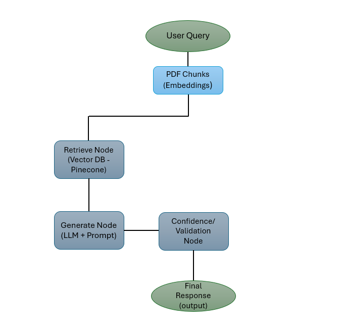

# RAG Implementation with Pinecone

# Setup Instructions

- **Python Version**: 3.10 or higher 
- **pip**: Latest version
- **API Keys**: OpenAI API key, Pinecone API key

- Setup free trial account with Pinecone
- Get the default API key (use the free tier)


**Create a directory for the project**

```
mkdir rag_with_pinecone
cd rag_with_pinecone
```


**Create a new python virtual env for hosting project's dependencies**

```
python -m venv venv_pinecone
```


**Activate venv**

For LINUX :

```
source venv_pinecone/bin/activate
```

For Windows :

```
source venv_pinecone/Scripts/activate
```

Install python dependencies

```
pip install -r requirements.txt
```

# Edit .env file

**Modify sample.env file with API key and index name and save as ".env" file.**


Run setup.py (to create index and upsert data)

```
python setup.py
```


Run app with uvicorn (on default port 8000)

```
uvicorn main:app --reload
```


Send a query using curl command from terminal (cmd)

```
curl -X POST http://localhost:8000/query \
  -H "Content-Type: application/json" \
  -d '{"query": "What is agentic AI?"}'
```


Send a query using FastAPI frontend

Launch - http://localhost:8000/docs and use "Try it out" option to send post query.

# Architecture Overview



# Project Structure

```
rag-project/
│
├── main.py                 # FastAPI entry point 
├── graph.py                # LangGraph workflow (retrieve → generate confidence)  
│
|── setup.py                 # API keys, model configs
│
├── docs/
│   └── Agentic_AI_Ebook.pdf
│
├── requirements.txt
├── README.md
├── Sample.env
└── .gitignore

```

# RAG + LangGraph Explanation

**What is RAG?**
- **Retrieval-Augmented Generation** combines information retrieval with text generation
- Instead of relying on LLM's training knowledge, we retrieve relevant context from our knowledge base
- The LLM then generates answers based ONLY on this retrieved context


**Why LangGraph?**
- **LangGraph** is a framework for building stateful, multi-step LLM workflows
- It provides a graph-based approach where each step (node) processes and transforms state
- Benefits:
  - **Clear workflow visualization**: Easy to understand and debug
  - **State management**: Automatically tracks data through the pipeline
  - **Modularity**: Each node (retrieve, context, generate) is independent
  - **Extensibility**: Easy to add new nodes (e.g., re-ranking, filtering)
  - **Production-ready**: Built-in error handling and logging


**Our LangGraph Pipeline:**
1. **Retrieve Node**: Query → Embeddings → Vector Search → Top Chunks
2. **Context Node**: Chunks → Formatted Context String
3. **Generate Node**: Context + Query → Grounded Prompt → LLM → Answer


# Design Decisions

- The PDF is chunked using recursive character splitting with a chunk size of 512 characters and overlap of 51 characters.

- A chunk size of 512 provides a strong balance between semantic completeness and retrieval precision.
- Smaller chunks improve the accuracy of vector similarity search by reducing irrelevant matches.
- An overlap of 51 characters ensures continuity of information across chunk boundaries and prevents loss of context between adjacent chunks.
- This configuration is well-suited for embedding models and keeps prompt context within LLM token limits.

This combination improves both retrieval relevance and answer grounding.


### Why this Embedding Model was chosen

The system uses OpenAI / HuggingFace embedding models optimized for semantic similarity search.

- Produces dense vector representations that capture semantic meaning effectively.

- Performs well on technical and long-form documents such as PDFs.

- Fully compatible with vector databases like Pinecone and FAISS.

### Why LangGraph Was Used

LangGraph was selected to implement a state-based AI workflow instead of a single linear chain.
It enables explicit modeling of retrieval, generation, and validation as independent nodes.Improves transparency and explainability of the RAG pipeline.
LangGraph provides fine-grained control over how information flows through the system.

### Grounding Enforce

Grounding is enforced through both architectural constraints and strict prompt control, ensuring all answers are sourced exclusively from the provided PDF.

**Retrieval-First Workflow:** The user query is never sent directly to the LLM. All responses must pass through a retrieval node that fetches relevant PDF chunks.

**Strict Context-Only Prompting:**
The LLM is instructed to answer only using retrieved context. If the answer is not present, it responds:  “Not found in document.”

**LangGraph-Controlled Execution:**  LangGraph enforces execution order, preventing answer generation without retrieved context and enabling optional validation steps.

**Transparent Output:** Each response returns the final answer, retrieved context chunks, and a confidence score.

# Sample Questions

Example 1

```
curl -X 'POST' \
  'http://localhost:8000/query' \
  -H 'accept: application/json' \
  -H 'Content-Type: application/json' \
  -d '{
  "query": "What is Agentic AI?"
}'
```
Response from RAG Agent
```
{
  "answer": {
    "ai_response": "Agentic AI refers to systems capable of autonomous decision-making and action in pursuit of specific objectives. This field has evolved from theoretical ideas to practical systems that are shaping industries. It encompasses understanding not just what Agentic AI is, but also how it works and why it matters.",
    "retrieved_chunks": [
      {
        "content": "Agentic AI\nAn Executive's Guide to In-depth\nUnderstanding of Agentic AI",
        "score": 0.765400469
      },
      {
        "content": "A Journey into the Heart of Autonomous Intelligence \n  \nAgentic AI refers to systems capable of autonomous decision-making and action in \npursuit of specific objectives. We have seen this field evolve from a set of theoretical \nideas to practical systems shaping industries. If you have been in AI long enough, you \nknow we are standing on the shoulders of giants. Let us take you through this, \nbreaking it down so you see not just what it is, but how it works and why it matters.",
        "score": 0.725999653
      },
      {
        "content": "� What value does it bring? \n                 � How are businesses using it in the real world? \nINTRODUCTION \nTO AGENTIC AI\n01",
        "score": 0.716006339
      }
    ],
    "confidence_score": 0.74
  }
}
```
Example 2
```
curl -X 'POST' \
  'http://localhost:8000/query' \
  -H 'accept: application/json' \
  -H 'Content-Type: application/json' \
  -d '{
  "query": "What are agents composed of?"
}'
```
Response from RAG Agent
```
{
  "answer": {
    "ai_response": "Agents are composed of several key elements, including the interaction between the agent, its environment, and its actions. The environment can be either static or dynamic, and the agent can be reactive or proactive. Additionally, a critical component is the decision-making layer, which employs sophisticated algorithms, including machine learning models and reinforcement learning, to analyze data and make informed decisions based on the agent's objectives and the current context. Memory and learning from interactions also play a significant role in the composition of agents.",
    "retrieved_chunks": [
      {
        "content": "2.2 Understanding the Building Blocks\nAt the heart of every Agentic AI system lies a delicate interplay of key elements: \nThe interaction between the agent, its environment, and its actions forms the \nfoundation of agentic AI. The environment can be static or dynamic, and the agent \ncan be reactive (responding to immediate stimuli) or proactive (planning for future \noutcomes). The agent’s use of memory and learning from interactions enables",
        "score": 0.521335423
      },
      {
        "content": "Agentic AI\nAn Executive's Guide to In-depth\nUnderstanding of Agentic AI",
        "score": 0.512908041
      },
      {
        "content": "Decision-Making Layer: \nAt the core of agentic systems is the decision-making layer. Here, the system \nemploys sophisticated algorithms to analyze incoming data and representations to \nmake informed decisions. This layer often incorporates elements of artificial \nintelligence such as machine learning models, reinforcement learning, or rule-based \nreasoning. The goal is to evaluate possible actions and select the most appropriate \nstrategy based on the system's objectives and current environmental context.",
        "score": 0.496787935
      }
    ],
    "confidence_score": 0.51
  }
}
```

Example 3

```
curl -X 'POST' \
  'http://localhost:8000/query' \
  -H 'accept: application/json' \
  -H 'Content-Type: application/json' \
  -d '{
  "query": "How do agent workflows differ from LLM chains?"
}'
```
Response from RAG Agent
```
{
  "answer": {
    "ai_response": "Agent workflows differ from LLM chains in that agents are goal-driven systems capable of performing actions autonomously in a dynamic environment, while LLMs primarily focus on processing and generating human-like text. Agents operate within a network, communicating and learning from past experiences to enhance decision-making, whereas LLM chains typically follow a more linear sequence of tasks without the same level of adaptability and autonomy.",
    "retrieved_chunks": [
      {
        "content": "The table below compares the key aspects of LLMs and agents:\nHow They Work Together? \nAgentic AI and LLMs work together to boost performance by combining specialized \nagents with LLM capabilities. These agents operate in a dynamic network, \ncommunicating efficiently and learning from past experiences to improve \ndecision-making. \nFor example: In customer service, an LLM generates responses to customer inquiries, \nwhile Agentic AI analyzes the context, learns from each interaction and human",
        "score": 0.590976536
      },
      {
        "content": "and Execution \n                 � Types and Categories of Agents \n                 � Applications Across Industries \nANATOMY OF \nAN AGENTIC AI \nSYSTEM\n11",
        "score": 0.539906442
      },
      {
        "content": "recipe. Agentic AI adapts to different situations, handling unstructured inputs, much \nlike a chef improvising with available ingredients. \nLLMs vs. Agentic AI: Distinct Roles, Complementary Strengths \nAgents are more than LLMs. While LLMs are powerful tools for processing and \ngenerating human-like text, agents are goal-driven systems capable of performing \nactions autonomously in a dynamic environment.   \nType Definition Capabilities Type Definition Capabilities \nTraditional AI\nNon-agentic AI",
        "score": 0.531404
      }
    ],
    "confidence_score": 0.55
  }
}
```

Example 4

```
curl -X 'POST' \
  'http://localhost:8000/query' \
  -H 'accept: application/json' \
  -H 'Content-Type: application/json' \
  -d '{
  "query": "What are limitations of agentic systems?"
}'
```
Response from RAG Agent
```
{
  "answer": {
    "ai_response": "The limitations of agentic systems include:\n\n1. **Complex System Design**: Designing agentic systems can be challenging due to the complexities of inter-agent communication and dependencies.\n\n2. **Interoperability Issues**: Integrating agents with existing systems (like ERP, WMS, and TMS) can be difficult, especially when agents are built on varying technologies or standards.\n\n3. **Data Security**: Sensitive data shared between agents and external vendors can be vulnerable to breaches, raising concerns about data security.\n\n4. **Conflict Resolution**: Managing conflicts among agents can be complicated, requiring effective strategies for resolution.\n\n5. **Scalability**: As the number of agents increases, ensuring that the system can scale effectively can be a challenge.\n\n6. **Cost of Implementation**: The initial costs associated with implementing agentic systems can be high.\n\n7. **Slow Development**: The development process for sophisticated agentic systems can be slow due to the need for careful design and testing.\n\n8. **Sophisticated Orchestration**: Coordinating the actions of multiple agents in a seamless manner can be complex and requires advanced orchestration strategies.",
    "retrieved_chunks": [
      {
        "content": "3.4 Challenges and Mitigation Strategies of \nMulti-Agent Systems \nChallenge\nComplex \nSystem Design \nInteroperability \nData \nSecurity \nConflict \nResolution \nScalability \nCost of \nImplementation \nSlow \nDevelopment \nSophisticated \nOrchestration \nDescription\nCan become difficult to \ndesign due to inter-agent \ncommunication and \ndependencies. \nIntegrating agents with \nexisting ERP, WMS, and TMS \nsystems can be difficult. \nSensitive data shared \nbetween agents and \nexternal vendors can be \nvulnerable to breaches.",
        "score": 0.612870216
      },
      {
        "content": "� Benefits, Challenges and Mitigation Strategies  \nMULTI-AGENT \nSYSTEMS\n23",
        "score": 0.612508953
      },
      {
        "content": "Agentic Systems\nCommunication and Coordination \n� Ensuring seamless communication among diverse agents can be difficult due to       \n   differences in functionality and sophistication. \n� Interoperability issues arise when agents are designed with varying \n   technologies or standards. \n� Developing a uniform protocol for interaction is often essential, but it can be   \n   complex to implement and requires collaboration within the community. \nConflict Management",
        "score": 0.605359
      }
    ],
    "confidence_score": 0.61
  }
}
```

Example 5

```
curl -X 'POST' \
  'http://localhost:8000/query' \
  -H 'accept: application/json' \
  -H 'Content-Type: application/json' \
  -d '{
  "query": "What are the core components of an Agentic AI system according to the ebook?"
}'
```
Response from RAG Agent
```
{
  "answer": {
    "ai_response": "The core components of an Agentic AI system include Perception, Reasoning, Planning, Learning, and Execution. These components work together to enable autonomous decision-making and action.",
    "retrieved_chunks": [
      {
        "content": "Agentic AI\nAn Executive's Guide to In-depth\nUnderstanding of Agentic AI",
        "score": 0.778007507
      },
      {
        "content": "In this section, we explore the core components of agentic AI, explaining \nhow they work together to enable autonomous decision-making and \naction, on what they are classified. How do agents perceive and interact \nwith their environment? What drives their decisions? How can they adapt \nand learn over time? Here we cover the following topics: \n                 � The Building Blocks of Agentic AI \n                 � Key Components: Perception, Reasoning, Planning, Learning, \n                    and Execution",
        "score": 0.757512748
      },
      {
        "content": "2.2 Understanding the Building Blocks\nAt the heart of every Agentic AI system lies a delicate interplay of key elements: \nThe interaction between the agent, its environment, and its actions forms the \nfoundation of agentic AI. The environment can be static or dynamic, and the agent \ncan be reactive (responding to immediate stimuli) or proactive (planning for future \noutcomes). The agent’s use of memory and learning from interactions enables",
        "score": 0.733753383
      }
    ],
    "confidence_score": 0.76
  }
}
```
Example 6
```
curl -X 'POST' \
  'http://localhost:8000/query' \
  -H 'accept: application/json' \
  -H 'Content-Type: application/json' \
  -d '{
  "query": "Explain the difference between traditional RAG and Agentic RAG mentioned in the text."
}'
```
Response from RAG Agent
```

  "answer": {
    "ai_response": "Not found in document.",
    "retrieved_chunks": [
      {
        "content": "Agentic AI\nAn Executive's Guide to In-depth\nUnderstanding of Agentic AI",
        "score": 0.409325957
      },
      {
        "content": "and treatment efficiency. \n3. Healthcare\n1.5 Agentic AI Use cases\n08\nAGENTIC AI FOR EXECUTIVES",
        "score": 0.377415895
      },
      {
        "content": "� What value does it bring? \n                 � How are businesses using it in the real world? \nINTRODUCTION \nTO AGENTIC AI\n01",
        "score": 0.374628961
      }
    ],
    "confidence_score": 0.39
  }
}
```

